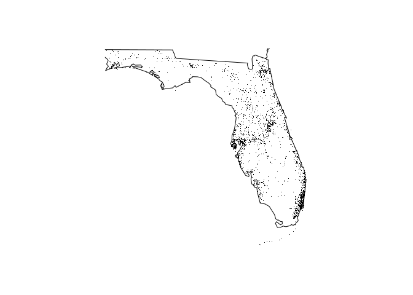

<!-- README.md is generated from README.Rmd. Please edit that file -->

# fars

<!-- badges: start -->

[](https://travis-ci.org/Halberdier/fars)
<!-- badges: end -->

The goal of fars is to facilitate visualization of data from the FARS,
the US National Highway Traffic Safety Administration’s Fatality
Analysis Reporting System.

## Installation

You can install the development version from
[GitHub](https://github.com/) with:

``` r
# install.packages("devtools")
devtools::install_github("Halberdier/fars")
```

## Exported functions

This package exports two convenient functions for visualization of data
from the FARS, the US National Highway Traffic Safety Administration’s
[Fatality Analysis Reporting
System](https://www.nhtsa.gov/Data/Fatality-Analysis-Reporting-System-\(FARS\)).

### Summarizing years

The first function is `fars_summarize_years`, which gets a vector of
years as argument and provides a tibble with one column per given year
with the number of accidents per month, as in the following example:

``` r
fars_summarize_years(c(2013, 2014))
#> # A tibble: 12 x 3
#>    MONTH `2013` `2014`
#>    <dbl>  <int>  <int>
#>  1     1   2230   2168
#>  2     2   1952   1893
#>  3     3   2356   2245
#>  4     4   2300   2308
#>  5     5   2532   2596
#>  6     6   2692   2583
#>  7     7   2660   2696
#>  8     8   2899   2800
#>  9     9   2741   2618
#> 10    10   2768   2831
#> 11    11   2615   2714
#> 12    12   2457   2604
```

### Plotting accidents on a state map

The second function is `fars_map_state`. Given a US state numeric code
and a year, it plots the accident locations on the state map. The states
are encoded according with the Federal Information Processing Standard
([FIPS](https://en.wikipedia.org/wiki/Federal_Information_Processing_Standard_state_code)).
In the following example, Florida is shown (code 12), easily
recognizable.

``` r
fars_map_state(12, 2014)
```


